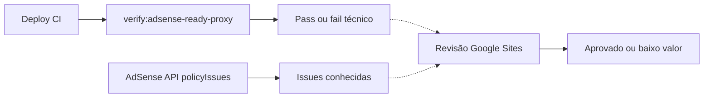

<!-- docs/adsense-site-readiness.md -->
# Brikaya — prontidão AdSense (conteúdo de baixo valor)

Última atualização: 2026-07-15.

## Fonte verificada

- Painel/e-mail AdSense (2026-07): violação **Conteúdo de baixo valor** em `brikaya.com`; botão “Confirmo que corrigi os problemas”.
- Políticas: [10502938](https://support.google.com/adsense/answer/10502938), [10015918](https://support.google.com/adsense/answer/10015918), [9044175](https://support.google.com/webmasters/answer/9044175), [11035931](https://support.google.com/publisherpolicies/answer/11035931).
- Live + código: jogo SPA + páginas legais curtas; páginas editoriais crawláveis em EN/PT (`/how-to-play/`, `/faq/`, `/updates/`); `ads.txt` com `pub-9571619183194136`.

**Veredito operacional:** a rejeição citada é editorial/qualitativa. Checklist técnico sozinho não aprova o site. Só peça revisão no AdSense **depois** de publicar conteúdo editorial substantivo e crawlável.

Não clique em “Confirmo que corrigi” com o site ainda só em shell de jogo + legais curtas.

---

## O que o Google marcou

| Exigência | Status | Evidência |
|---|---|---|
| Conteúdo suficiente / não “baixo valor” | **NÃO CONFORME (citado)** até revisão nova após remediação | Painel AdSense |
| Conteúdo exclusivo que explique o assunto | **Em remediação** | Páginas `/how-to-play/`, `/faq/`, `/updates/` (EN + PT-BR) |
| Motivo para visitar e voltar (além do app) | **Em remediação** | FAQ + updates; sem blog recorrente ainda |
| Evitar páginas com pouco/nenhum conteúdo | **RISCO residual** | Home/downloads continuam SPA; legales multilocalizadas |

O AdSense **só citou** conteúdo de baixo valor nesta rejeição. Outros motivos não foram inventados.

---

## Matriz de exigências (links oficiais)

Legenda: **OK** · **FALHA** · **RISCO** · **NV** (não verificável sem conta AdSense/GSC) · **N/A**.

### A) Conteúdo e UX ([10015918](https://support.google.com/adsense/answer/10015918))

| Exigência | Status | Nota |
|---|---|---|
| Bastante conteúdo exclusivo | **FALHA histórica / remediação em curso** | Legais ~100–160 palavras; editoriais EN/PT adicionadas |
| Atualizar conteúdo regularmente | **RISCO** | `/updates/` existe; não há calendário editorial automatizado |
| Sem conteúdo duplicado / scraped | **OK parcial / RISCO** | Texto original; sitemap ainda multiplica locales legais |
| Navegação clara | **OK parcial** | Nav em legais/editoriais; home = jogo |
| Sem links quebrados / promessas falsas | **NV + amostragem** | Rotas canônicas amostradas; 2.800+ URLs não auditadas uma a uma |
| Layout legível / multi-browser | **NV qualitativo** | Produto jogável ≠ valor editorial |

### B) Valor do inventário ([10502938](https://support.google.com/adsense/answer/10502938))

| Exigência | Status | Nota |
|---|---|---|
| Não monetizar telas sem conteúdo / baixo valor | **FALHA (citada)** | Tema da rejeição |
| Não “em construção” | **OK aparente** | HTTP 200 no domínio público |
| Idioma suportado | **OK aparente** | PT/EN e outros |
| Mais anúncio que conteúdo | **N/A agora** | `__BRIKAYA_GOOGLE_ADS_ENABLED__ = false` |
| Conteúdo ilegal / sexual / perigoso / enganoso | **OK aparente (não citado)** | Sem sinal no painel |
| Declarações desonestas / ads.txt | **OK aparente** | `ads.txt` live correto |

### C) Spam / thin content Search

| Exigência | Status | Nota |
|---|---|---|
| Evitar thin content | **FALHA alinhada / remediação** | Editoriais EN/PT; legales ainda curtas |
| Evitar doorway / cookie-cutter | **RISCO** | Muitos locales × templates legais |
| Cloaking / scraped / UGC spam | **OK aparente / N/A** | Sem UGC |
| Manual actions no Search Console | **NV** | Sem acesso GSC nesta documentação |

### D) Painel Sites

| Item | Status | Nota |
|---|---|---|
| Propriedade | **NV no painel** | Snippet + `ads.txt` presentes no live |
| Site pronto para anúncios | **NÃO** (até nova aprovação) | E-mail + painel |
| Pedir revisão | Só após remediação real | Não confirmar correção prematuramente |

---

## Automação a cada deploy

**Não existe ferramenta oficial do Google que aprove “conteúdo valioso” no CI.** A decisão continua humana no painel Sites.

| Capacidade | Automatizável? | Limite |
|---|---|---|
| `ads.txt` + publisher | Sim | Não prova conteúdo |
| Snippet `ca-pub-…` | Sim | Só propriedade/verificação |
| Palavras mínimas em páginas editoriais | Sim (proxy) | Limiar arbitrário do repo |
| Detectar home SPA magra | Sim (informativo) | Não substitui revisão |
| Sitemap: editoriais só EN/PT | Sim | Evita thin locale clone |
| [`accounts.policyIssues.list`](https://developers.google.com/adsense/management/reference/rest/v2/accounts.policyIssues) | Sim (OAuth) | Só issues **já** detectadas |
| Aprovação “baixo valor” | **Não** | Só revisão Sites |

Gate local: `npm run verify:adsense-ready-proxy` (documentado como **proxy**, não como aprovação AdSense).

---

## Remediação neste repositório

1. Páginas editoriais crawláveis (HTML estático): `/how-to-play/`, `/faq/`, `/updates/` em **en-US** e **pt-BR** apenas.
2. Gate `verify:adsense-ready-proxy` no `build` / CI.
3. Estado operacional em [`docs/monetizacao-google.md`](monetizacao-google.md).

Aprovação AdSense/H5 **nunca é garantida**.
